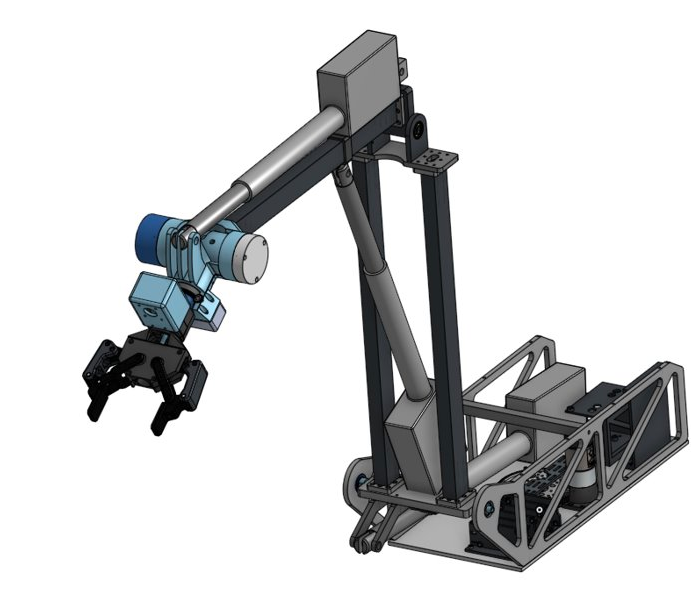

# zeus_arm



This package contains all the necessary code to operate the physical arm module or the gazebo simulation. To launch the simulation, open a terminal and enter the following command

```
roslaunch zeus_arm simulation.launch
```

To control the physical arm (not functional yet), the command is 

```
roslaunch zeus_arm teleop.launch
```

The main difference between the simulation and the actual robot is the low-level control. On the actual arm, the Arduino Mega 2560 passes the joint velocity commands through a PI 
control loop and sends the resulting commands to the motor drivers for each joint. The Arduino also reads the encoders positions and sends them back to the arm's onboard PC (Jetson Nano)
. In the simulation, this part is handled by the ros_control package, which simulates fake controllers for the robot's joints. In both cases, an user interface will appear when launching the robot. This interface lets the user modify the desired cartesian speed of the robot and the lambda gain of the singularity avoidance algorithm, which determines how much it is accepted to deviate from the robot's trajectory to avoid a singular position. There is also a video feed for the camera on the robot's wrist. The video feed is only available on the real robot.

The robot is controlled with an Xbox controller

```
---------------------------
Change control mode: Start button

Joint control mode:
  Left joystick up = +Theta
  Left joystick down = -Theta
  A button = Change to previous joint
  Y button = Change to next joint

Cartesian control mode:
  Left joystick up = +X
  Left joystick down = -X
  Left joystick left = +Y
  Left joystick right = -Y
  Right joystick up = +Z
  Right joystick down = -Z
  Left numpad = + Theta Y
  Right numpad = - Theta Y
  Up numpad = + Theta X
  Down numpad = - Theta X
  LB = + Theta Z
  RB = - Theta Z 
  
CTRL-C to quit
```
## File structure

#### config
This folder contains the .yaml file for the ros_control controllers. It also has the exported perspective of the rqt interface of the arm. If you want to modify the UI's appearance, export it from rqt and save it in this file.

#### launch
This folder has the necessary launch files to run the simulation or the real arm 

#### meshes
This folder has all of the exported STL files of the robot for the simulation. These are referenced to in the URDF file.

#### msg
This folder has the msg file for the custom ROS message used in the code.

#### scripts
This folder has all the python and C/C++ (Arduino) files to run the robot (simulation and real).

#### urdf
This folder has the URDF file used by gazebo to render the robot arm and its physics. It was exported using the onshape-to-robot open source package. For more details, visit : https://github.com/Rhoban/onshape-to-robot.


