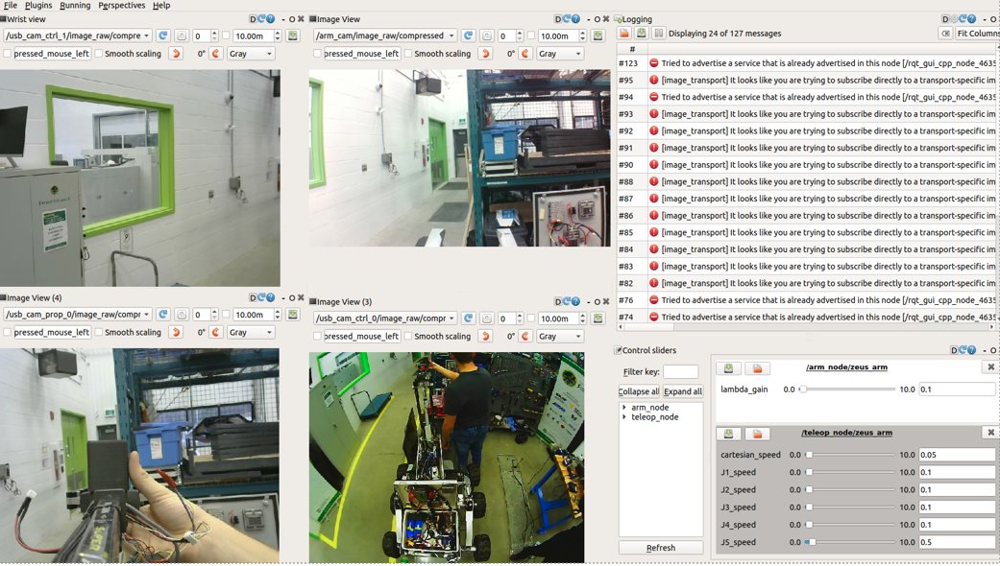

# zeus_arm


This package contains all the necessary code to operate the physical arm module or the gazebo simulation. 

## Usage
To launch the simulation, open a terminal and enter the following command
```
roslaunch zeus_arm simulation.launch
```
This will launch the gazebo simulation of the robotic arm as well as the user interface.

To control the physical arm, the following steps must be done : 

1. Inside your .bashrc file (hidden file inside your home directory on ubuntu 18.04), paste the following lines :
```
export ROS_IP=192.168.1.34
export ROS_MASTER_URI=http://192.168.1.34:11311
```
This sets your coomputer's IP address in the rover's LAN and also tells ROS that the master is on your computer (essential for the multi-master functionality of the rover). Currently, address 192.168.1.34 is used by default, but any other adress will work as long as it's a valid address within the LAN. This step only needs to be done once.

2. Open two separate terminals. On one terminal, connect to the arm's jetson via SSH, with the following command: 
 ```
 ssh zeus-arm@192.168.1.33
 ```
The password is `zeus`. Once you're connected to the arm's jetson, run the following command:
```
roslaunch zeus_arm bringup.launch
```
This will launch the necessary scripts on the jetson, which include the ROS nodes for the usb cameras, the multi-master functionality and also Rosserial for communication with the Arduino board.

3. In the second terminal, run:
```
roslaunch zeus_arm teleop.launch
```
This will launch everything you need at the base station : joystick node, multi-master scripts, the arm node, script that reads joystick inputs and the user interface.

The main difference between the simulation and the actual robot is the low-level control. On the actual arm, the Arduino Mega 2560 passes the joint velocity commands through a PI 
control loop and sends the resulting commands to the motor drivers for each joint. The Arduino also reads the encoders positions and sends them back to the arm's onboard PC (Jetson Nano).
In the simulation, this part is handled by the ros_control package, which simulates fake controllers for the robot's joints. 

## Developing
If you wish to develop new features on the arm without necessarily having to use the communication system for testing, you can connect the arm's Arduino directly to your computer and turn on the arm using the steps described previously. However, you will need to launch the Rosserial node from a terminal or add it to the launch file (usually, this node is ran on the Jetson and it is included in the Jetson's `bringup.launch` file).

## User interface
In the simulation and when controlling the real arm, an user interface will appear when launching the robot. This interface lets the user modify the desired cartesian speed of the robot (cartesian mode), the lambda gain of the singularity avoidance algorithm (cartesian mode), which determines how much it is accepted to deviate from the robot's trajectory to avoid a singular position and the individual speed of each joint (joint mode). There is also four video feeds for the camera on the robot's wrist and three other angles that the operator can choose. All of the video feed from the rover are available to use on the interface. The video feed is only available on the real robot (the camera is not yet simulated in gazebo).



## Controls 
The robot is controlled with an Xbox controller

```
---------------------------
Change control mode: Start button

Joint control mode:
  Left joystick up = +Theta
  Left joystick down = -Theta
  A button = Change to previous joint
  Y button = Change to next joint
  X button = Open gripper 
  B button = Close gripper

  J1 = Left joystick up (CW)
  J1 = Left joystick down (CCW)

  J2 = Left joystick up (down)
  J2 = Left joystick down (up)

  J3 = Left joystick up (down)
  J3 = Left joystick down (up)

  J4 = Left joystick up (down)
  J4 = Left joystick down (up)

  J5 = Left joystick up (CW)
  J5 = Left joystick down (CCW)

Cartesian control mode:
  Left joystick up = +X
  Left joystick down = -X
  Left joystick left = +Y
  Left joystick right = -Y
  Right joystick up = +Z
  Right joystick down = -Z
  Left numpad = + Theta Y
  Right numpad = - Theta Y
  Up numpad = + Theta X
  Down numpad = - Theta X
  LB = + Theta Z
  RB = - Theta Z 
  X button = Open gripper 
  B button = Close gripper


  
CTRL-C to quit
```
## File structure

#### config
This folder contains the .yaml file for the ros_control controllers. It also has the exported perspective of the rqt interface of the arm. If you want to modify the UI's appearance, export it from rqt and save it in this file.

#### launch
This folder has the necessary launch files to run the simulation or the real arm 

#### meshes
This folder has all of the exported STL files of the robot for the simulation. These are referenced to in the URDF file.

#### msg
This folder has the msg file for the custom ROS message used in the code.

#### scripts
This folder has all the python and C/C++ (Arduino) files to run the robot (simulation and real).

#### urdf
This folder has the URDF file used by gazebo to render the robot arm and its physics. It was exported using the onshape-to-robot open source package. For more details, visit : https://github.com/Rhoban/onshape-to-robot.


